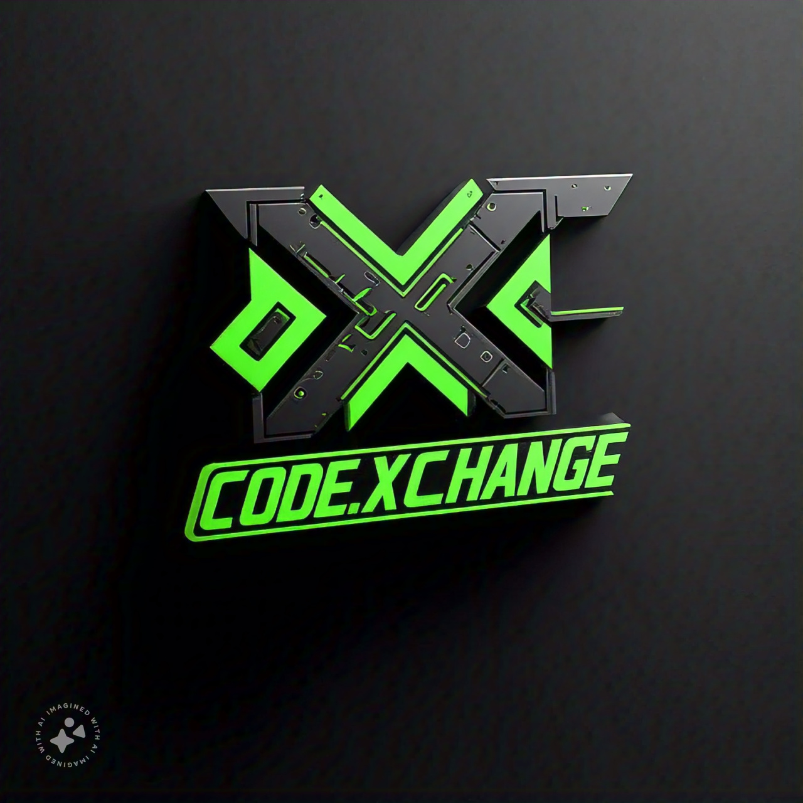

<p align="center">
  
</p>

<h1 align="center">🚀 Code_X_Change</h1>

<p align="center">
  <b>The Ultimate Code Converter & Explainer</b><br/>
  <i>Convert code between languages and get instant explanations in a beautiful, modern interface.</i>
</p>

<p align="center">
  <a href="#features"></a>
  <a href="#getting-started"></a>
  <a href="#license"></a>
</p>

---

<p align="center">
  
  
</p>

---

<p align="center">
   <b>Open Source & Community Driven</b>
</p>

---


<h2 id="features">✨ Features</h2>

<ul>
  <li>🔄 <b>Code Converter:</b> Instantly convert code between <b>20+ programming languages</b> with a single click.</li>
  <li>💡 <b>Code Explainer:</b> Get <b>AI-powered explanations</b> for any code snippet, in plain English.</li>
  <li>🎨 <b>Modern UI:</b> Responsive, accessible, and visually stunning design powered by <b>Tailwind CSS</b>.</li>
  <li>🌙 <b>Dark/Light Mode:</b> Seamless theme switching for comfortable coding day or night.</li>
  <li>🧩 <b>Component-Based:</b> Modular, reusable React components for easy maintenance and scalability.</li>
  <li>🚀 <b>Fast & Secure:</b> Built with <b>Next.js</b> for optimal performance, SEO, and security.</li>
  <li>🖥️ <b>Live Preview:</b> See your converted code and explanations instantly, side by side.</li>
  <li>🛡️ <b>Privacy First:</b> Your code never leaves your browser unless you choose to use cloud features.</li>
  <li>🧑‍� <b>Open Source:</b> Community-driven, MIT licensed, and ready for your contributions!</li>
</ul>


<h2>�📂 Project Structure</h2>

```text
app/         → Next.js app directory (routing, API, layout)
components/  → Reusable UI and feature components
hooks/       → Custom React hooks
lib/         → Utility functions and language definitions
public/      → Static assets (images, fonts, banners)
```


<h2>🛠️ Tech Stack</h2>

<p align="center">
  
</p>

- <a href="https://nextjs.org/">Next.js</a>
- <a href="https://react.dev/">React</a>
- <a href="https://www.typescriptlang.org/">TypeScript</a>
- <a href="https://tailwindcss.com/">Tailwind CSS</a>


<h2 id="getting-started">🚀 Getting Started</h2>

<ol>
  <li><b>Clone the repository:</b>
    <pre><code>git clone https://github.com/AmitavaDatta2004/Code_X_Change.git</code></pre>
  </li>
  <li><b>Install dependencies:</b>
    <pre><code>npm install</code></pre>
  </li>
  <li><b>Run the development server:</b>
    <pre><code>npm run dev</code></pre>
  </li>
  <li><b>Open in your browser:</b><br/>
    Visit <a href="http://localhost:3000">http://localhost:3000</a>
  </li>
</ol>


<h2>🧑‍💻 Contributing</h2>

We love contributions! If you have ideas, bug fixes, or new features, please open an issue or submit a pull request.

<details>
<summary><b>How to contribute</b></summary>

1. Fork this repository
2. Create a new branch (`git checkout -b feature/your-feature`)
3. Commit your changes
4. Push to your fork and submit a pull request

</details>


<h2 id="license">📄 License</h2>

This project is licensed under the <a href="LICENSE">MIT License</a>.

---

<p align="center">
  <b>Made with ❤️ by the Code X Change Team</b><br/>
  <a href="https://github.com/AmitavaDatta2004/Code_X_Change">GitHub</a> • <a href="#">Website</a>
</p>
